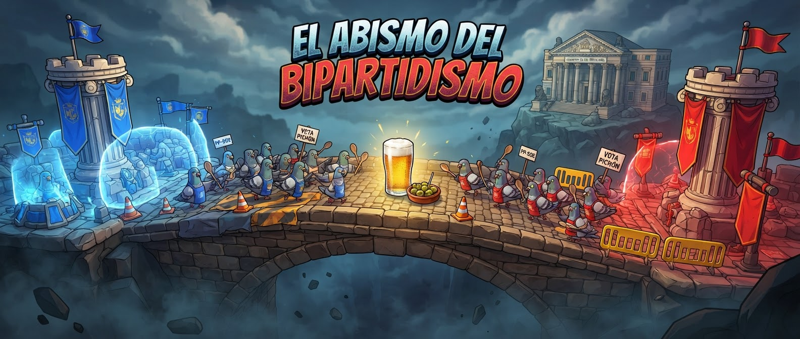

# open-aram — El Abismo del Bipartidismo



See [INIT.md](INIT.md) for the full design reference and [CLAUDE.md](CLAUDE.md) for contributor/agent rules.

Browser 3D ARAM (Three.js + Colyseus) wrapped in Spanish political satire.

```bash
npm install
npm run dev        # Colyseus on :2567 + Vite on :5173
npm test           # headless sim smoke test (every ability/summoner, waves, nexus win)
```

Open http://localhost:5173 in two windows, create a room in one, join from the other.

Controls: right-click move/attack · QWER abilities · D/F summoners · B recall · P shop · TAB scoreboard ·
T emotes · Z/X/V/G pings (Alt+click = danger) · C stats · Enter chat · Esc menu · wheel zoom.

Layout: `shared/data.ts` (champions, items, spells, runes, map) · `server/sim.ts` (authoritative sim) ·
`server/GameRoom.ts` (lobby → select → loading → game) · `client/game.ts` (scene, HUD, VFX) ·
`client/models.ts` (procedural toon models) · `client/audio.ts` (synth SFX/music, speechSynthesis announcer).
`e2e.js` is a two-tab Playwright script (Playwright MCP `browser_run_code_unsafe`).
